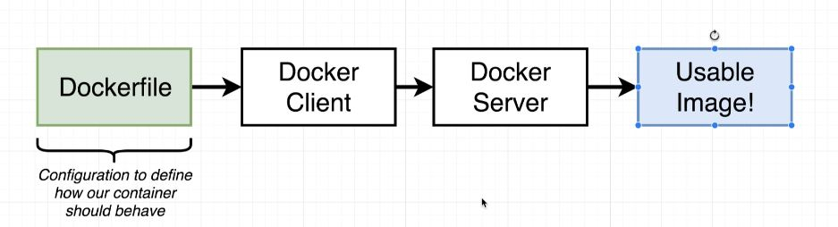
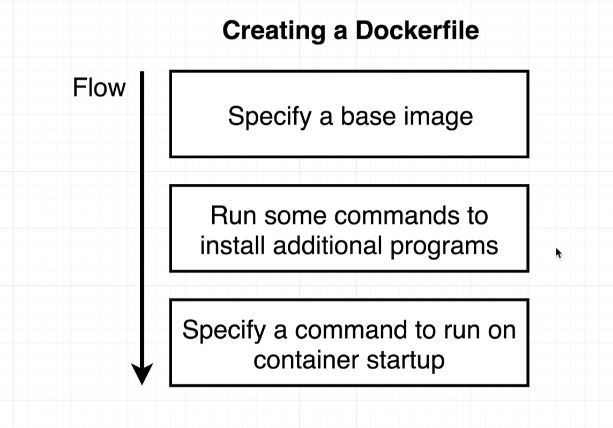
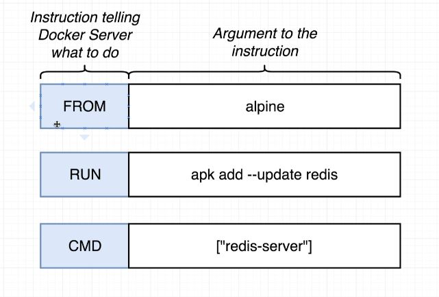

# Some basic commands

- docker create hello-world
- docker start -a 55464656
 
- docker run hello-world
- docker run busybox echo hi there
- docker run busybox ls
- docker run -it busybox sh
- docker run busybox ping google.com
- docker run = docker create <imgname> + docker start -a <containerid>
- docker start -a 859276a0c
- docker stop 859276a0c

- docker exec -it 859276a0c redis-cli
- docker exec -i -t 859276a0c redis-cli
- docker exec -it 859276a0c sh

- docker logs 859276a0c

- docker ps
- docker ps -all

- docker system prune

- docker build .

(after the image created)

- docker run a2d2b488a16c

When building new images, its better to tag in order not to
use always IDs:
- docker build -t hazyikmis/nodesimpleapp .

- docker build -t hazyikmis/redis:latest .

# Creating new image from a running container
1. first, run an image with a shell (to install something...)
> > docker run -it alpine sh
2. whit this command you are on the shell inside the docker container you just run. Install redis, or any other pack
> /# apk add --update redis
3. leave this shell open (container running), open another shell, and execute ps command to list all running containers, find your newly run alpine container, use its id
> docker ps
> docker commit -c 'CMD ["redis-server"]' <containerid>
4. vollia, your new image created and its id shown. You can use it, run it....
> docker run 345353535

# Port mapping
There's no limitation by default on your containers ability to reach out. It's strictly a limitation on the ability for incoming traffic to get in to the container. So in order to set up this mapping in order to kind of forward this traffic to a specific port inside the container we're going to make a slight adjustment to the way in which we start the container up or specifically the docker run command. So this is not a change that we're going to make to the docker file. We do not setup port forwarding inside the doctor file the port forwarding stuff is strictly a runtime constraint. In other words it's something that we only change when we run a container or start a container up. So here's what we're gonna do to setup Docker run with port mapping.

> docker run -p 8080:8080 hazyikmis/nodesimpleapp

In order to connect the container and execute some commands inside the docker

> docker run -it hazyikmis/nodesimpleapp sh

(But this creates another container from the same image. In order to connect exact same container:)

> docker exec -it <containerId> sh

# Check the COMMENTS inside the file:

